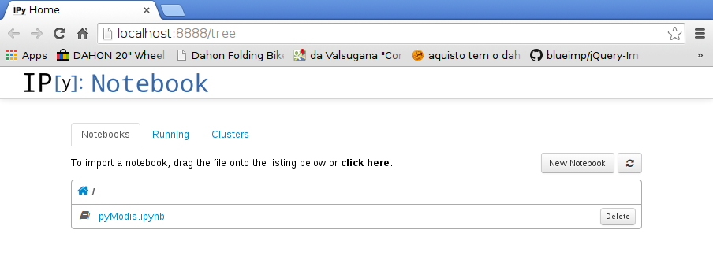

Examples
========

Some example about ``pyModis`` library and script

Scripts
^^^^^^^

.. only:: latex

  * :doc:`full_example_gdal`
  * :doc:`full_example_mrt`

  .. raw:: latex

    \newpage % hard pagebreak at exactly this position

.. toctree::
   :maxdepth: 4

   full_example_gdal
   full_example_mrt

Library
^^^^^^^

To test ``pyModis`` library you can find an `Ipython notebook`_ example
in the documentation source code.
If you already downloaded ``pyModis`` source code you have just to
move inside the directory ``pyModis/docs/source/examples`` otherwise
you can download the needed file from
`source code <https://raw.githubusercontent.com/lucadelu/pyModis/master/docs/source/examples/pyModis.ipynb>`_
and move to the directory where you downloaded the file.

At this point you can start `Ipython notebook`_ running a notebook server
from the command line using the following command

::

  ipython notebook

This will print some information about the notebook server in your console,
and open a web browser to the URL of the web application.

The landing page of the IPython notebook web application, the dashboard,
shows the notebooks currently available in the notebook directory
(in our case only **pyModis.ipynb**).

Clicking on **pyModis.ipynb** link you will start the notebook

.. image:: ../_static/ipython_example.png
  :scale: 40%
  :alt: Ipython notebook pyModis example
  :align: center

.. warning::

    You have to install ``pyModis`` before run the `Ipython notebook`_ example.

.. _Ipython notebook: http://ipython.org/notebook.html