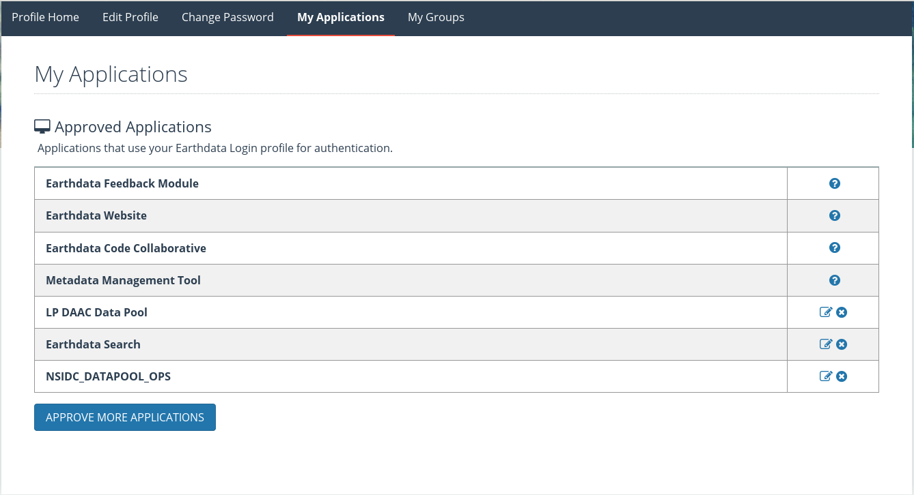

About pyModis
=============

Requirements
------------

``pyModis`` requires **Python GDAL**, **Numpy**, **requests** and **future** packages.

If you want to use the Graphical User Interface you have to
install also **wxPython** library.

You can use also software is `MODIS Reprojection Tool <https://lpdaac.usgs.gov/tools/modis_reprojection_tool>`_
to convert or mosaic MODIS HDF files.

.. _userpw-label:

User and password
^^^^^^^^^^^^^^^^^
To be able to download data you need user and password provided by NASA.
Please **register at https://urs.earthdata.nasa.gov/users/new**; now login
and move to your profile page. Go to "My application" tab and approve the
following applications "LP DAAC Data Pool", "Earthdata Search" (for Snow products you
have to enable also "NSIDC_DATAPOOL_OPS").

If you are an already registered user, login and enable the applications
at https://urs.earthdata.nasa.gov/home

How to install pyModis
----------------------

Using pip
^^^^^^^^^

From version 0.6.3 it is possible to install ``pyModis`` using
`pip <https://pypi.python.org/pypi/pip>`_. You have to run the following
command as administrator

.. code-block:: none

  pip install pyModis

If you need to update your ``pyModis`` version you have to run

.. code-block:: none

  pip install --upgrade pyModis

With ``pip`` it is also really simple to remove the library

.. code-block:: none

  pip uninstall pyModis

Compile from source
^^^^^^^^^^^^^^^^^^^

Compile ``pyModis`` is very simple. First you need to download ``pyModis``
source code from `github repository <https://github.com/lucadelu/pyModis>`_.

You can use `git <http://git-scm.com/>`_ to download the latest code
(with the whole history and so it contain all the different stable versions,
from the last to the first)

.. code-block:: none

    git clone https://github.com/lucadelu/pyModis.git

or `download the latest stable version <https://github.com/lucadelu/pyModis/tags>`_
from the repository and decompress it.

Now enter the ``pyModis`` folder and launch as administrator of
your computer

.. code-block:: none

    python setup.py install

If the installation doesn't return any errors you should be able to use
``pyModis`` library from a Python console. Then, launch a your favorite
Python console (I really suggest ``ipython``) and digit ::

    import pymodis

If the console doesn't return any error like this ::

    ImportError: No module named pymodis

the ``pyModis`` library has been installed properly and you can use it
or one of the tools distributed with ``pyModis``.

If you want to install into /usr/local/, run

.. code-block:: none

    python setup.py install --prefix=/usr/local

In this case, if you get the following error

.. code-block:: none

    TEST FAILED: /usr/local/lib/python2.7/site-packages/ does NOT support .pth files

then you need to define the PYTHONPATH environmental variable ::

    export PYTHONPATH=/usr/local/lib/python2.7/site-packages
    python setup.py install --prefix=/usr/local

and now re-run the installation command.

Install on Windows with osgeo4w
^^^^^^^^^^^^^^^^^^^^^^^^^^^^^^^

.. warning::

  Using this way to install pyModis it will be possible to use pyModis
  only from OSGeo4W environment.

  It will not possible to use other versions of Python except the OSGeo4W one.

The simple way to install ``pyModis`` on Windows is to use
`OSGeo4W <http://trac.osgeo.org/osgeo4w/>`_.

.. note::

  To execute OSGeo4W may be required to run it as Administrator.

Choose *Advanced Install* in the first step of installation and set the
corrected value until the packages selection.

At this point select the following packages:

* *gdal-python*
* *python-numpy*
* *python-requests*
* *python-future*
* *wxpython*

OSGeo4W will install all the required dependencies.

At this point, using the OSGeo4W shell, you can follow `Compile from source`_
section to install pyModis.

Install on Windows without osgeo4w (old and not updated)
^^^^^^^^^^^^^^^^^^^^^^^^^^^^^^^^^^^^^^^^^^^^^^^^^^^^^^^^^^^

Another way to install ``pyModis`` on Windows is to install latest Python 2.7
from http://python.org/download/

Now you have to modify the "Path" environment variable using *powershell* running

.. only:: html

  .. code-block:: none

    [Environment]::SetEnvironmentVariable("Path", "$env:Path;C:\Python27\;C:\Python27\Scripts\", "User")

.. only:: latex

  .. code-block:: none

    [Environment]::SetEnvironmentVariable("Path",
    "$env:Path;C:\Python27\;C:\Python27\Scripts\", "User")

Download and install the last version of Distribute for Windows from
http://python-distribute.org/distribute_setup.py

At this point you have to move to standard command line (*cmd*) and install *pip*
using *easy_install*

.. code-block:: none

    easy_install pip

Now install `numpy <http://www.numpy.org>`_ library using *easy_install* because
installation from pip is broken (this is required only for version >= 0.7.1)

.. code-block:: none

    easy_install numpy GDAL

If you want the Graphical User Interface you have to install also **wxPython**

.. code-block:: none

    easy_install WxPython WxPython-Common

Finally install ``pyModis`` using *pip*

.. code-block:: none

    pip install pyModis

If you want use the GUI you have to `download and install wxPython <http://www.wxpython.org/download.php>`_

Troubleshooting
---------------

Problem installing dependencies with pip
^^^^^^^^^^^^^^^^^^^^^^^^^^^^^^^^^^^^^^^^

.. warning::

    Sometimes *pip* return error when it try to install Python GDAL, Numpy or wxPython.
    You can solve this problem installing Python GDAL or Numpy using the
    version of your operating system.

How to report a bug
-------------------

If you find any problems in ``pyModis`` library you can report it using
the `issues tracker of github <https://github.com/lucadelu/pyModis/issues>`_.

How to compile documentation
----------------------------

This documentation has been made with `Sphinx <http://sphinx.pocoo.org>`_, so you
need to install it to compile the original files to obtain different
output formats.

Please enter the ``docs`` folder of ``pyModis`` source and run ::

    make <target>

with one of the following target to obtain the desired output:

  - **html**: to make standalone HTML files
  - **dirhtml**: to make HTML files named index.html in directories
  - **singlehtml**: to make a single large HTML file
  - **pickle**: to make pickle files
  - **json**: to make JSON files
  - **htmlhelp**: to make HTML files and a HTML help project
  - **qthelp**: to make HTML files and a qthelp project
  - **devhelp**: to make HTML files and a Devhelp project
  - **epub**: to make an epub
  - **latex**: to make LaTeX files, you can set PAPER=a4 or PAPER=letter
  - **latexpdf**: to make LaTeX files and run them through pdflatex
  - **text**: to make text files
  - **man**: to make manual pages
  - **texinfo**: to make Texinfo files
  - **info**: to make Texinfo files and run them through makeinfo
  - **gettext**: to make PO message catalogs
  - **changes**: to make an overview of all changed/added/deprecated items
  - **linkcheck**: to check all external links for integrity
  - **doctest**: to run all doctests embedded in the documentation (if enabled)

PDF link in HTML
^^^^^^^^^^^^^^^^
To insert a link to PDF file of pyModis documentation into HTML documentation
(the link will be added on the sidebar) you have to compile first the PDF and
after the HTML, so you need to launch::

  make latexpdf
  make html

If PDF file is missing no link will be added

Ohloh statistics
----------------

.. only:: html

  .. raw:: html

      <table align="center">
	<tr>
	  <td align="center">
	    
	  </td>
	  <td align="center">
	    
	  </td>
	</tr>
	<tr>
	  <td align="center">
	    
	  </td>
	  <td align="center">
	    
	  </td>
	</tr>
      </table>

.. only:: latex

  For more information about ``pyModis`` please visit the
  `pyModis Ohloh page <http://www.ohloh.net/p/pyModis>`_
