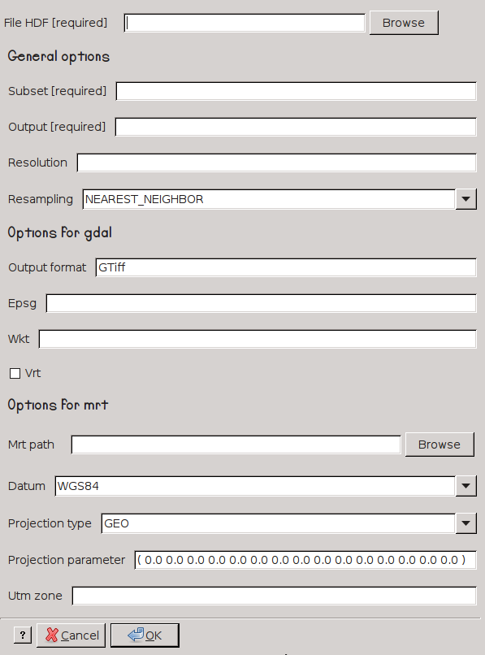

modis_convert.py
----------------

**modis_convert.py**  converts MODIS data to TIF formats and different
projection reference system. It is an interface to MRT mrtmosaic
software or GDAL library.

Usage
^^^^^
.. code-block:: none

    modis_convert.py [options] hdf_file

Options
^^^^^^^

.. code-block:: none

  -h, --help            show this help message and exit

  Required options:
    -s SUBSET, --subset=SUBSET
                        (Required) a subset of product's layers. The string
                        should be similar to: ( 1 0 )
    -o OUTPUT_FILE, --output=OUTPUT_FILE
                        (Required) the prefix of output file
    -g RESOLUTION, --grain=RESOLUTION
                        the spatial resolution of output file
    -r RESAMPLING_TYPE, --resampl=RESAMPLING_TYPE
                        the method of resampling. -- mrt methods:
                        'NEAREST_NEIGHBOR', 'BICUBIC', 'CUBIC_CONVOLUTION',
                        'NONE' -- gdal methods: 'AVERAGE', 'BILINEAR',
                        'CUBIC', 'CUBIC_SPLINE', 'LANCZOS', 'MODE',
                        'NEAREST_NEIGHBOR' [default=NEAREST_NEIGHBOR]

  Options for GDAL:
    -f OUTPUT_FORMAT, --output-format=OUTPUT_FORMAT
                        output format supported by GDAL [default=GTiff]
    -e EPSG, --epsg=EPSG
                        EPSG code for the output
    -w WKT, --wkt_file=WKT
                        file or string containing projection definition in WKT
                        format
    -v, --vrt           Read from a GDAL VRT file.
    --formats           print supported GDAL formats

  Options for MRT:
    -m MRT_PATH, --mrt=MRT_PATH
                        the path to MRT software
    -d DATUM, --datum=DATUM
                        the code of datum. Available: 'NODATUM', 'NAD27',
                        'NAD83', 'WGS66', 'WGS72', 'WGS84' [default=WGS84]
    -t PROJECTION_SYSTEM, --proj_type=PROJECTION_SYSTEM
                        the output projection system. Available: 'AEA', 'GEO',
                        'HAM', 'IGH', 'ISIN', 'LA', 'LCC', 'MOL', 'PS', 'SIN',
                        'TM', 'UTM', 'MERCAT' [default=GEO]
    -p PROJECTION_PARAMETERS, --proj_parameters=PROJECTION_PARAMETERS
                        a list of projection parameters, for more info check
                        the 'Appendix C' of MODIS reprojection tool user's
                        manual https://lpdaac.usgs.gov/content/download/4831/2
                        2895/file/mrt41_usermanual_032811.pdf [default=( 0.0
                        0.0 0.0 0.0 0.0 0.0 0.0 0.0 0.0 0.0 0.0 0.0 0.0 0.0
                        0.0 )]
    -u UTM_ZONE, --utm=UTM_ZONE
                        the UTM zone if projection system is UTM
              the UTM zone if projection system is UTM

Examples
^^^^^^^^

.. warning::
    The resolution value in ``modis_convert.py`` has to be set with the
    right value depending on the projection used. 1 kilometer in metrical
    projection has to be set as 1000 meter, instead in latitude and longitude
    something like 0.01* depending on the placement in the Earth.

MODIS Reprojection Tools
""""""""""""""""""""""""

.. warning::

    You can find the supported projections in the 'Appendix C' of
    `MODIS reprojection tool user's manual`_ and the datums at section
    ``Datum Conversion`` of the same manual

Convert layers from MODIS data with the original resolution in
latitude and longitude reference system

.. code-block:: none

    modis_convert.py -s "( 1 0 1 0 )" -o OUTPUT_FILE -m "/usr/local/bin/" FILE

Convert layers from MODIS data with output resolution in 500 meters with
UTM projection in the 32 zone

.. code-block:: none

    modis_convert.py -s "( 1 0 1 0 )" -o OUTPUT_FILE -m "/usr/local/bin/" -g 500 -p UTM -u 32 FILE

GDAL
""""

Convert the first layer in latitude and longitude with the original resolution

.. code-block:: none

    modis_convert.py -s "( 1 )" -o OUTPUT_FILE -e 4326 FILE

Convert the first three layers from MODIS data with output resolution in 500
meters with UTM projection in the 32 zone

.. code-block:: none

    modis_convert.py -s "( 1 1 1 )" -o OUTPUT_FILE -g 500 -e 32632 FILE

.. _`MODIS reprojection tool user's manual`: https://lpdaac.usgs.gov/sites/default/files/public/mrt41_usermanual_032811.pdf

.. only:: latex

  .. raw:: latex

    \newpage % hard pagebreak at exactly this position
