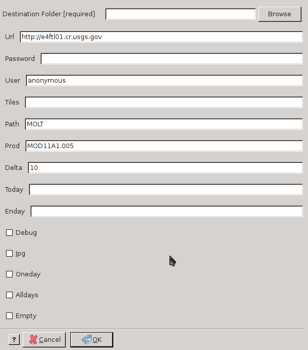

modis_download.py
-----------------
**modis_download.py** downloads MODIS data from NASA FTP servers.
It can download large amounts of data and it can be profitably
used with cron jobs to receive data with a fixed delay of time.

.. warning::

  Remember to register yourself at https://urs.earthdata.nasa.gov/users/new,
  read more at :ref:`userpw-label` session.

.. note::

  The script is able also to read the
  `.netrc file <https://www.gnu.org/software/inetutils/manual/html_node/The-_002enetrc-file.html>`_.
  You have to add something similar to this ::

    machine urs.earthdata.nasa.gov
    login YOURUSER
    password YOURPASSWD

Usage
^^^^^

::

    modis_download.py [options] destination_folder

Options
^^^^^^^

.. code-block:: none

    -h  --help        shows the help message and exit
    -u  --url         http/ftp server url [default=https://e4ftl01.cr.usgs.gov]
    -I   --input      insert user and password from standard input
    -P  --password    password to connect
    -U  --username    username to connect
    -t  --tiles       string of tiles separated by comma
                      [default=none] for all tiles
    -s  --source      directory on the http/ftp server
                      [default=MOLT]
    -p  --product     product name as on the http/ftp server
                      [default=MOD11A1.005]
    -D  --delta       delta of day starting from first day [default=10]
    -f  --firstday    the day to start download, if you want change
                      data you have to use this format YYYY-MM-DD
                      ([default=none] is for today)
    -e  --endday      the day to finish download, if you want change
                      data you have to use this format YYYY-MM-DD
                      ([default=none] use delta option)
    -x                useful for debugging the download
                      [default=False]
    -j                download also the jpeg files [default=False]
    -O                download only one day, it sets delta=1 [default=False]
    -A                download all days, useful for initial download of a
                      product. It overwrites the 'firstday' and 'endday'
                      options [default=False]
    -r                remove files with size same to zero from
                      'destination_folder'  [default=False]

Examples
^^^^^^^^

Download Terra LST data for a month for two tiles from HTTP server

.. code-block:: none

    modis_download.py -I -r -t h18v03,h18v04 -f 2008-01-01 -e 2008-01-31 lst_terra/

Download the last 15 days of Aqua LST data

.. code-block:: none

    modis_download.py -I -r -s MOLA -p MYD11A1.005 -t h18v03,h18v04 -D 15 lst_aqua/

Download all tiles of NDVI for one day (you have pick the right day otherwise it does not download anything)

.. code-block:: none

    modis_download.py -U user -P passwd -r -p MOD13Q1.005 -f 2010-12-31 -O

Download Snow product from FTP server

.. only:: html

  .. code-block:: none

    modis_download.py -I -u ftp://n4ftl01u.ecs.nasa.gov -p mail@pymodis.com -s SAN/MOST -p MOD10A1.005

.. only:: latex

  .. code-block:: none

    modis_download.py -I -u ftp://n4ftl01u.ecs.nasa.gov -p mail@pymodis.com
    -s SAN/MOST -p MOD10A1.005

  .. raw:: latex

    \newpage % hard pagebreak at exactly this position
