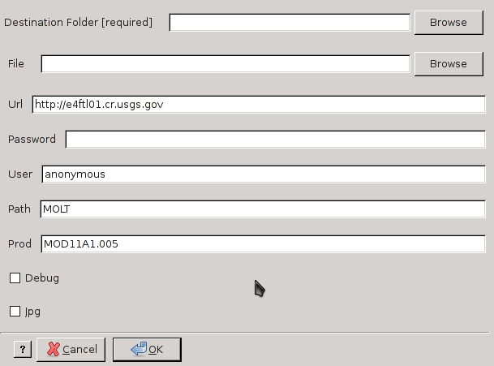

modis_download_from_list.py
---------------------------

**modis_download_from_list.py** downloads MODIS data from NASA servers,
the names of files to download have to be contained into a text file.

.. warning::

  Remember to register yourself at https://urs.earthdata.nasa.gov/users/new,
  read more at :ref:`userpw-label` session.

.. note::

  The script is able also to read the
  `.netrc file <https://www.gnu.org/software/inetutils/manual/html_node/The-_002enetrc-file.html>`_.
  You have to add something similar to this ::

    machine urs.earthdata.nasa.gov
    login YOURUSER
    password YOURPASSWD

Usage
^^^^^

.. code-block:: none

    modis_download_from_list.py [options] destination_folder

Options
^^^^^^^

.. code-block:: none

    -h  --help        show the help message and exit
    -f  --file        Input file containing data to donwload
    -u  --url         http/ftp server url [default=https://e4ftl01.cr.usgs.gov]
    -I  --input       insert user and password from standard input
    -P  --password    password to connect
    -U  --username    username to connect
    -s  --source      directory on the http/ftp
                      [default=MOLT]
    -p  --product     product name as on the http/ftp server
                      [default=MOD11A1.006]
    -o  --outputs     the output where write the missing files in the server
                      [default=none]. Use 'stdout' to write to  STDOUT
    -n                use netrc file to read user and password
    -x                this is useful for debugging the download
                      [default=False]
    -j                download also the jpeg files [default=False]

Examples
^^^^^^^^

The following text should be in your *MODTiles.txt* file

.. code-block:: none

  MOD11A1.A2012278.h19v11.005.*.hdf*
  MOD11A1.A2012278.h19v12.005.*.hdf*
  MOD11A1.A2012278.h20v11.005.*.hdf*
  MOD11A1.A2012278.h20v12.005.*.hdf*
  MOD11A1.A2012278.h21v11.005.*.hdf*

Download Terra LST data from the above text file

.. code-block:: none

    modis_download_from_list.py -U user -P passwd -f /tmp/MODTiles.txt /tmp

The following text should be in your *MYDTiles.txt* file

.. code-block:: none

  MYD11A1.A2012278.h19v11.005.*.hdf*
  MYD11A1.A2012278.h19v12.005.*.hdf*
  MYD11A1.A2012278.h20v11.005.*.hdf*
  MYD11A1.A2012278.h20v12.005.*.hdf*
  MYD11A1.A2012278.h21v11.005.*.hdf*

Download Aqua LST data from the above text file

.. code-block:: none

    modis_download_from_list.py -I -s MOLA -p MYD11A1.005 -f /tmp/MYDTiles.txt /tmp

.. only:: latex

  .. raw:: latex

    \newpage % hard pagebreak at exactly this position
