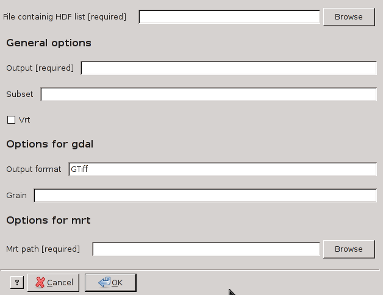

modis_mosaic.py
----------------

**modis_mosaic.py** creates a mosaic of several MODIS tiles in
HDF format, using MRT mrtmosaic software or GDAL library.

Usage
^^^^^^
::

    modis_mosaic.py [options] hdflist_file

Options
^^^^^^^

::

  General options:
    -o OUTPUT_FILE, --output=OUTPUT_FILE
                        (Required) the name or prefix (for VRT) of output
                        mosaic
    -s SUBSET, --subset=SUBSET
                        a subset of product layers. The string should be
                        similar to: 1 0 [default: all layers]

  Options for GDAL:
    -f OUTPUT_FORMAT, --output-format=OUTPUT_FORMAT
                        output format supported: GTiff, HDF4Image
                        [default=GTiff]
    -v, --vrt           Create a GDAL VRT file. No other GDAL options have to
                        been set

  Options for MRT:
    -m MRT_PATH, --mrt=MRT_PATH
                        (Required) the path to MRT software

Examples
^^^^^^^^

MODIS Reprojection Tools
"""""""""""""""""""""""""""

Convert all the layers of several tiles::

    modis_mosaic.py -m "/usr/local/bin/" -o FILE_mosaik MOSAIK_FILES_LIST

Convert LAYERS of several LST MODIS tiles::

    modis_mosaic.py -s "1 0 1 0" -m "/usr/local/bin/" -o FILE_mosaik MOSAIK_FILES_LIST

GDAL
""""""""""""

Convert the first LAYERS of several tiles with resolution 1km in GeoTIFF format::

    modis_mosaic.py -o FILE_mosaik.tif -s "1"  MOSAIK_FILES_LIST

Create a mosaic with all the layers of several tiles in HDF4Image format::

    modis_mosaic.py -o FILE_mosaik.hdf -f HDF4Image MOSAIK_FILES_LIS

Create VRT file for all subset. It create a VRT file for each subset with the
choosen prefix (``-o`` flag) and the name of layer as suffix::

    modis_mosaic.py -o mosaik_vrt -v MOSAIK_FILES_LIS

.. only:: latex

  .. raw:: latex

    \newpage % hard pagebreak at exactly this position
