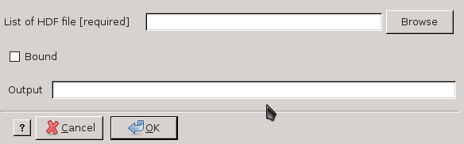

modis_multiparse.py
-------------------

**modis_multiparse.py** parses several XML metadata files 
for MODIS tiles. It is very useful to create XML metadata file for a 
mosaic.

Usage
^^^^^
.. code-block:: none

    modis_multiparse.py [options] hdf_files_list

Options
^^^^^^^

.. code-block:: none

    -h  --help     show the help
    -b             print the values related to the spatial max extent
    -w  --write    write the MODIS XML metadata file for MODIS mosaic

Examples
^^^^^^^^

Print values of spatial bounding box

.. code-block:: none

    modis_multiparse.py -b hdf_file1 hdf_file2 ...

Write xml file to use with hdf file created by :doc:`modis_convert`

.. code-block:: none

    modis_multiparse.py -w FILE_mosaic.xml hdf_file1 hdf_file2 ...

.. only:: latex

  .. raw:: latex

    \newpage % hard pagebreak at exactly this position
