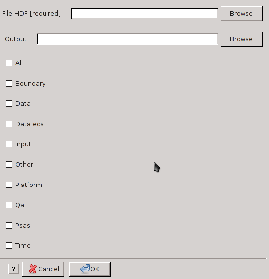

modis_parse.py
--------------

**modis_parse.pys** parses the XML metadata file for a MODIS
tile and return the requested value. It can also write the metadata information
into a text file.

Usage
^^^^^
.. code-block:: none

    modis_parse.py [options] hdf_file

Options
^^^^^^^

.. code-block:: none
    
    -h  --help     show the help
    -w  --write    write the chosen information into a file
    -a             print all possible values of metadata
    -b             print the values related to the spatial max extent
    -d             print the values related to the date files
    -e             print the values related to the ECSDataGranule
    -i             print the input layers
    -o             print the other values
    -p             print the values related to platform
    -q             print the values related to quality
    -s             print the values related to psas
    -t             print the values related to times
    -l             print the names of layer in HDF file 

Examples
^^^^^^^^

Return all values of metadata

.. code-block:: none

    modis_parse.py -a hdf_file

Write all values to a file

.. code-block:: none

    modis_parse.py -a -w metadata_FILE.txt hdf_file

Print spatial extent and quality

.. code-block:: none

    modis_parse.py -b -q hdf_file

.. only:: latex

  .. raw:: latex

    \newpage % hard pagebreak at exactly this position
