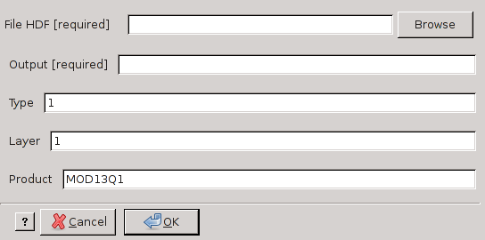

modis_quality.py
----------------

**modis_quality.py** checks the quality of MODIS data using the QA layer

Usage
^^^^^
.. code-block:: none

    modis_quality.py [options] input_file destination_file

Options
^^^^^^^

.. code-block:: none

  -h, --help            show this help message and exit
  -o OUTPUT_FILE, --output=OUTPUT_FILE
                        (Required) the prefix of output file
  -t TYPE, --type=TYPE  quality type either as number or name (e.g. 1 or
                        VIQuality for MOD13 products) [default=1]
  -l LAYER, --qualitylayer=LAYER
                        quality layer of the dataset, dependent on the used
                        MODIS product. (e.g. 1 or QC_Day for the Daytime QC
                        Layer of MOD11) [default=1]
  -p PRODUCT, --producttype=PRODUCT
                        quality layer of the dataset, dependent on the used
                        MODIS product. (e.g. 1 or QC_Day for the Daytime QC
                        Layer of MOD11) [default=MOD13Q1]

Examples
^^^^^^^^

Extract VI Usefulness value from MOD13 product

.. code-block:: none

    modis_quality.py -t 2 infile.hdf -o outfile.tif

Extract shadow mask from MOD13 product

.. code-block:: none

    modis_quality.py -t 9 input_file.hdf -o destination_file.tif

Extract Emissitivity error flag of Nighttime LSTE quality control from MOD11C1 product

.. code-block:: none

    modis_quality.py -t 4 -l 2 infile.hdf -o outfile.tif

Extract MODLAND QA value from MOD13Q1 mosaic

.. code-block:: none

    modis_quality.py -t 1 -p MOD13Q1 input_file.hdf -o destination_file.tif

.. only:: latex

  .. raw:: latex

    \newpage % hard pagebreak at exactly this position
